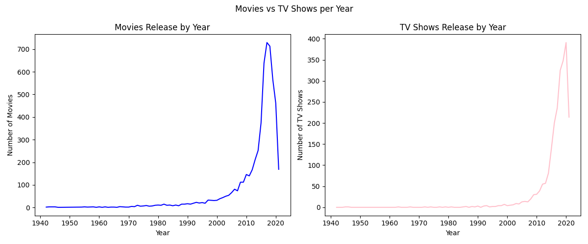

# 📊 Netflix Titles Data Analysis & Visualization

This project analyzes the Netflix dataset to gain insights into the platform’s content library. Using Python and popular libraries like **Pandas**, **Matplotlib**, and **NumPy**, the project includes data cleaning, exploratory data analysis, and visualization to better understand Netflix’s movie and TV show catalog.

---

## 📁 Dataset

- **Source:** [Netflix Titles Dataset on Kaggle](https://www.kaggle.com/datasets/shivamb/netflix-shows)
- **File:** `netflix_titles.csv`

---

## 🔍 Objectives

- Compare the number of **Movies vs TV Shows**
- Analyze the distribution of **content ratings**
- Visualize the distribution of **movie durations**
- Explore release year trends and content volume
- Identify top countries producing Netflix content
- Visualize yearly trends of Movies and TV Shows side-by-side

---

## 🛠️ Technologies Used

- Python 3
- Pandas
- Matplotlib
- NumPy

---

## 📈 Visualizations

| Visualization Type            | Description                                   | File Name                             |
|------------------------------|-----------------------------------------------|-------------------------------------|
| Bar Chart                    | Count of Movies vs TV Shows                    | `Movies_vs_Tv shows.png`             |
| Pie Chart                   | Percentage breakdown of content ratings        | `content_rate_pie.png`               |
| Histogram                   | Distribution of movie durations                 | `DUARTION_x_MOVIEShistogram.png`    |
| Scatter Plot                | Release year vs number of shows                 | `release year vs no_of_shows.png`   |
| Horizontal Bar Chart        | Top 10 countries producing Netflix content     | `countries count based on shows hbar.png` |
| Subplots                   | Movies and TV Shows released per year           | `movies_vs_tv_shows_subplot.png`    |

---

## 📷 Sample Visualizations


### Top 10 Countries Which Produced the Highest Number of Shows


### Release Year vs Number of Shows


### Movie vs TV Shows Subplot



## 🚀 How to Run

1. Clone this repository:

```bash
git clone https://github.com/Jayypatell23/netflix-data-visualization.git
